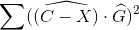
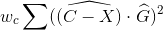
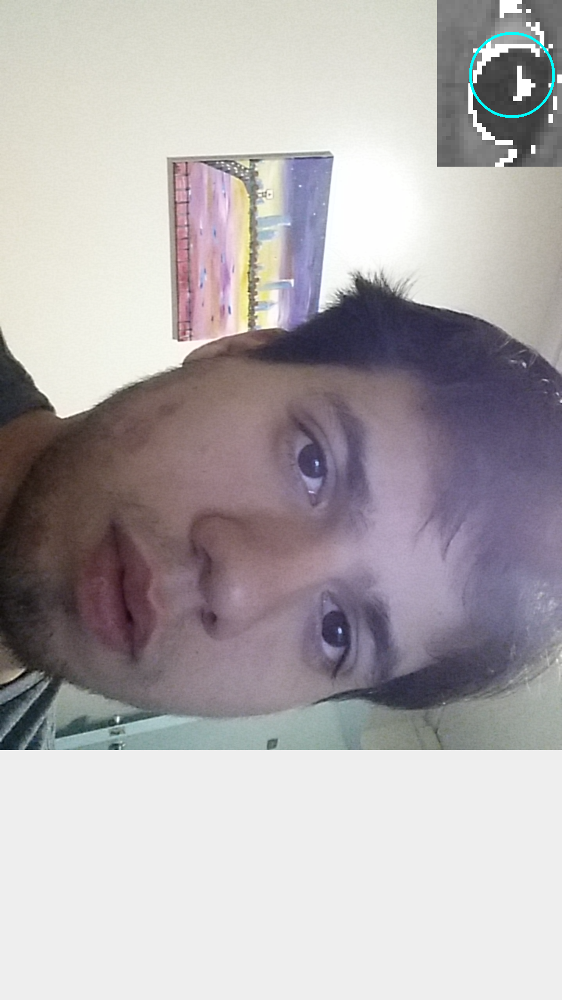
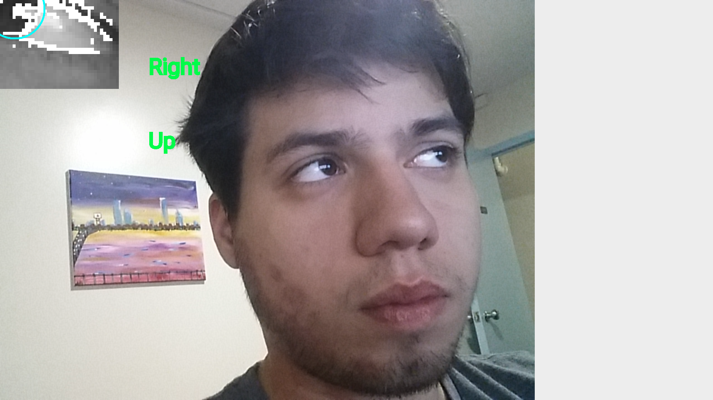
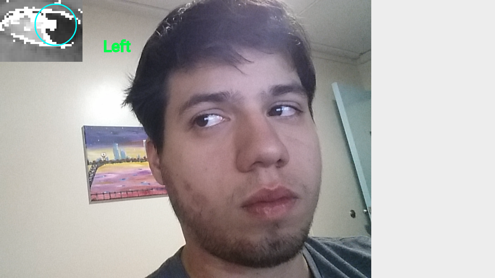

# AndroidGaze
Project for Smartphone Vision. Android app that tracks your Iris and predicts whether you are looking up/down, and left/right.

### Introduction

Gaze tracking refers to being able to predict where a user is looking at by extracting features from a image.
It has applications in road safety, by predicting whether a driver is alert and focused. In accessibility where a user might be able to control a phone by looking at specific areas,
and also in marketing and ux/design where it is important to track which elements in a page might draw the user's attention.
It can be computationally expensive, since some of the methods require either processing the image through a CNN,
as demonstrated by [I-Tracker](http://gazecapture.csail.mit.edu/cvpr2016_gazecapture.pdf).

This project however only uses Android SDK and Google GMS libraries, making the Android app very lightweight.
The code is inspired from the IEEE paper by [Anjith George and Aurobinda Routray](https://arxiv.org/pdf/1605.05272.pdf) for low resolution gaze tracking
and the Institute for Neuro-and Bioinformatics paper by [Fabian Timm and Erhardt Barth](http://www.inb.uni-luebeck.de/publikationen/pdfs/TiBa11b.pdf) for Eye Centre localisation by means of gradients.

##### Disclaimer

All this was tested only with a Galaxy Note S3 using the front facing camera, and a person with brown eyes. Code might not be generalized enough to work well with other (for better or worse) camera resolutions, slower processors, or brighter eyes.

Additionally, some assumptions as to how far away the phone would be were made (Roughly 1.3 feet away from face) as most of my testing was done by me in selfie mode.
The head pose of the person is also assumed to be facing the camera and fairly consistent.

Also, in order to use the gms libraries, the phone needs to have the google play services enabled.

### Methods

There are roughly three steps in Gaze Prediction:

1. Find General Eye Position
  * Can be done fast using HAAR Cascade Classifiers 
  * Can take advantage of com.google.gms.vision.face.FaceDetector
2. Find Center of Iris
  * Uses Gradients to find center of dark circle
3. Given location of Iris, predict gaze position

This code focuses mostly on aspect 2. It takes advantage of the gms libraries to do 1, and instead of predicting exact gaze position, distinguishes only between up/down, and left/right.

#### Find General Eye Position.
As stated, this can be done fairly simply using the gms library. The FaceDetector API can provide multiple Face objects and a callback can be written to do extra image processing on each Face object.
It also provides the information of where landmarks are located, such as the Right and Left Eye. 

In this code we throw away all information except the location of the Right Eye (and only use that eye in order to not waste time processing both eyes).
Then we grab a rectangular region centered at the eye location with a height of eyeRegionHeight=60 and a width of eyeRegionWidth=80 pixels.
This eyeImage is stored unto a Bitmap and grayscaled.

The resulting image is fairly small, so it must be upsampled to be displayed for debugging purposes.

#### Find Center of Iris

##### Gradient Field
First, we need to create a gradient for the bitmap image. This is done by iterating through every pixel and taking the difference between said pixel and the previos pixel in x and y coordinates.
To ignore edge conditions, we start at the second row and second column, and end in the second to last row and column. This gives the partial derivative of brightness in both x and y coordinates.
From here we calculate the magnitude and divide the two components in order to turn the gradient into a unit vector. 
The gradients are stored in a double array[][] where the first index correspond to the pixel number and the second to the x or y coordinate. This was faster than using a tuple data type.

##### Center of Iris
The main idea of this algorithm is the assumption that the iris can be reduced to a circle with very strong gradients at its circunference.
Additionally, given any point C inside the eye, the dot product between the unit vector from C to the gradient at an edge of the iris, and the gradient would be maximum if they were both pointing in the same direction.
This is only true for all gradients in the iris if the point C is at the center of the circle.

Therefore the point is to find the coordinate C such that it maximizes the equation accross all pixels X:

Where X is the vector corresponding to the pixel in question, C is the proposed center of the iris, and G is the gradient at pixel X.

However, it is possible that due to shadows, reflections, or an are betwen the corners of the eye, edge of the iris, and eyelashes might be detected using this approach,
since it would be near the center of a lot of strong gradients. However, since we know the center of the iris should be much darker we can bias the equation to prefer a dark center.
So instead we find the pixel at coordinate C that maximises the following equation.

Where w_c is the inverse of the brightness value at coordinate C.

##### Optimizations

This algorithm does not run very fast without some optimizations.

###### Downsampling Bitmap
The first optimization we applied is that we down sample the eye bitmap before calculating gradients and finding the iris center.
This offers two advantages. First, it reduces the number of pixels we need to iterate over by a factor of 4 (assuming we downsample by a factor of 2).
Since this is a cubic run time algorithm, this offers a theoretical speed up of a constant factor of 64.
Additionally, it helps deal with image noise when calculating the gradient, since down sampling on the android will help average out nearby pixels.

###### Ignoring Gradients with Small Magnitudes
The second optimization we applied is that when storing the gradients, we only store those that achieve a magnitude of some threshold mGradThreshold, before turning them into unit vectors.
We then ignore all gradients that did not meet this threshold when calculating the center of the iris. This offers a very good speed up.
Additionally, it also helps performance, since the equation is not swayed by very small gradients likely caused by shadows or noise.

To find the right threshold, I displayed the EyeBitmap and highlighted the pixels with gradients above the chosen threshold until the circunference of the iris was clearly distinguishable.

###### Reducing Window for Gradients in Iris Center Search
Since the iris is small relative to the entire eye, we can expect all relevant gradients to be within some region of the center iris pixel C.
Therefore we use a threshold dThresh, that constraints the gradients to be used in the above equations to be within a radius of dThresh pixels from C.
This both speeds up performance by reducing the number of pixels searched for, but also improves performance by not having the values swayed by pixels very far away.

To pick an appropriate dThresh, I resized and drew the region that was considered for the final Iris Center detection until I achieved both an acceptable Real Time run time,
and more than the entire Iris was also in the dThresh region.

#### Predicting Gaze

In this code, this is fairly simple. We have the iris coordinates with respect to the center of the eye, and a threshold for what is considered up/down and left/right.
Depending where the user is looking at, the android app will display either nothing, or some combination of left/right and up/down.

A more complex project would use the x,y values of the Iris Pixel and fit it into a cubic equation to calculate the X,Y values in screen coordinates that the user is looking at.
However, that requires a calibration step, and was outside of the scope for this project. I may revise it and add to it as future work.

### Challenges

There were multiple challenges in this project. The main one was simply learning how to use the gms libraries for FaceDetection.
It wasn't straight forward how to extract the image after the FaceDetector returned the location of the face landmarks.
Additionally, I spent a lot of time figuring how to convert the different image objects such as Image, bitmap, canvas, frame, into the appropriate ones with the right format.
This led to a lot of crashing code, badly formatted images with the wrong color format, segfaults, nullptr errors and a lot of searching for help.

The second main challenge was also testing. It is difficult to look at a direction that is not the phone and look at the data being output by the phone at the same time.

Thirdly, without the optimizations discussed above, it was very difficult to actually run the app and see whether the algorithm worked or not.

Some difficulties also arose with the nature of this problem. Reflection on the iris can creater strong gradients for example. However, with tweaked parameters, I still managed to locate the center of the iris fairly reliably. It's hard to detect when the person is looking down though, as they tend to drop their eyelids which covers a good part of the iris.

### Future Work

Given more time, I would try to optimize the the Iris Center detection algorithm by trying to remove the square in the equation we try to maximize.
It might be possible to solve a similar equation analitically, and not have to iterate through all the pixels multiple times. Additionally, I would put more work into the third step,
adding a calibration step and using the iris center pixel coordinates to predict more accurately where exactly is the user looking at.
Finally, I would try not to use so many hard coded thresholds, and either use a calibration step to find the best ones, or make them relate to each other more so that it works at different distances.

Another thing that might be interesting to add, is to also use more features from the FaceDetector api. The api also includes information about head pose or likelihood that the person is blinking.
This information might be useful to incorporate as well.

### Images of App Demo

Note that the color images are flipped verically so that it looks like the mirror image of me.

 

